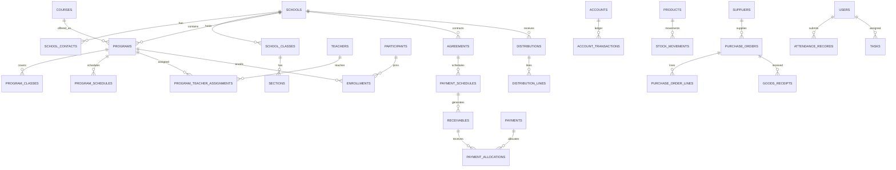

# Conceptual ERD (Mermaid)

```mermaid
erDiagram
  SCHOOLS ||--o{ SCHOOL_CONTACTS : has
  SCHOOLS ||--o{ SCHOOL_CLASSES : contains
  SCHOOL_CLASSES ||--o{ SECTIONS : has
  COURSES ||--o{ PROGRAMS : offered_as
  SCHOOLS ||--o{ PROGRAMS : hosts
  PROGRAMS ||--o{ PROGRAM_CLASSES : covers
  PROGRAMS ||--o{ PROGRAM_SCHEDULES : schedules
  PROGRAMS ||--o{ PROGRAM_TEACHER_ASSIGNMENTS : assigned
  TEACHERS ||--o{ PROGRAM_TEACHER_ASSIGNMENTS : teaches
  PROGRAMS ||--o{ ENROLLMENTS : enrolls
  PARTICIPANTS ||--o{ ENROLLMENTS : joins
  SCHOOLS ||--o{ AGREEMENTS : contracts
  AGREEMENTS ||--o{ PAYMENT_SCHEDULES : schedules
  PAYMENT_SCHEDULES ||--o{ RECEIVABLES : generates
  PAYMENTS ||--o{ PAYMENT_ALLOCATIONS : allocates
  RECEIVABLES ||--o{ PAYMENT_ALLOCATIONS : receives
  ACCOUNTS ||--o{ ACCOUNT_TRANSACTIONS : ledger
  PRODUCTS ||--o{ STOCK_MOVEMENTS : movements
  SUPPLIERS ||--o{ PURCHASE_ORDERS : supplies
  PURCHASE_ORDERS ||--o{ PURCHASE_ORDER_LINES : lines
  PURCHASE_ORDERS ||--o{ GOODS_RECEIPTS : received
  SCHOOLS ||--o{ DISTRIBUTIONS : receives
  DISTRIBUTIONS ||--o{ DISTRIBUTION_LINES : lines
  USERS ||--o{ ATTENDANCE_RECORDS : submits
  USERS ||--o{ TASKS : assigned
```
